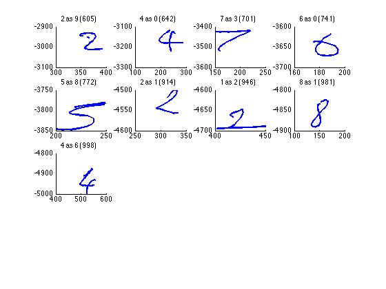
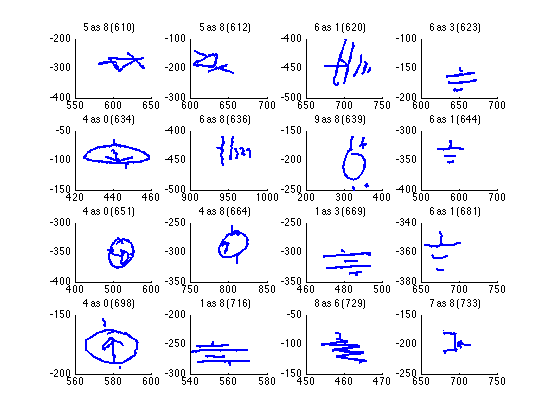
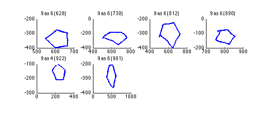

Will Whitney

# Image Recognition

All source code included. Consult `createFeatureImage.m`, `recognizeSymbol.m`, and `test.m`. The last of these was the training code I used to determine optimal parameters.

## Accuracy

The accuracy of the system is clearly affected by the parameters, but not to a tremendous degree (within a reasonable parameter range). The improvement with my best parameters over the defaults was 8% on circuits, 4% on digits, and actually slightly negative for shapes.

### Best Parameters
	
Using my best parameters, this system achieved an accuracy of 97.75% on `digits`, 88% on `circuits`, and 98.5% on `shapes`.
	
There were two parameters mentioned in the assignment, `sigma` and `h`, but there was one more: the window used for tangent approximations. I ran a test on the `digits` set using three possible values around the defaults for each of these three parameters, for a total of nine combinations. These possible values were:
	
	h = {16, 24, 32} (before downsampling)
	tangentWindowSize = {5, 10, 15}
	sigma = {0.5, 1.0, 1.5}
			
From these, the optimal selection on the `digits` set was `h=16, tangentWindowSize=5, sigma=1.5`

### Errors

#### Digits

	errors =

	   605   642   701   741   772   914   946   981   998
	   

#### Circuits

	errors =

	  Columns 1 through 11
	
	   610   612   620   623   634   636   639   644   651   664   669
	
	  Columns 12 through 22
	
	   681   698   716   729   733   735   738   740   746   748   773
	
	  Columns 23 through 33
	
	   781   794   799   813   836   849   857   861   867   871   887
	
	  Columns 34 through 44
	
	   889   892   893   907   913   938   948   957   959   962   965
	
	  Columns 45 through 48
	
	   971   975   981   997
	   

	   
#### Shapes

	errors =

	   628   730   812   890   922   981
	   

#### Analysis

Some of the errors here were made for good reason. The 'five' in the second row of digits, for example, I wouldn't have been able to identify myself, and similarly I would say that the 'six' in the first row would be _better_ labeled a zero. Some errors, like the first two in the second row, were probably made because of orientation problems. Others may simply have been not quite similar enough to the training set, which IDM might help.

Several of the shape and circuit cases are likewise at slightly off angles, or have been nonuniformly deformed.

### Default Parameters
	
Using the default parameters of `h=24, tangentWindowSize=10, sigma=1.0`, this system had an accuracy of 93.75% on `digits`, 80% on `circuits`, and 99.5% on `shapes`.

## Additional Steps

Of the steps described in the paper, accounting for rotations has to be the biggest (and simplest) improvement to make to this system. While in the case of digits, the system could reasonably be expected to get digits in only one orientation (or, equivalently, with a known orientation), and thus rotation-insensitivity wouldn't help much, in the cases of circuits and shapes many orientations will likely be encountered. As it stands, this system only matches different orientations when a sample of that orientation exists in the training set, which would drastically reduce effectiveness in real-world situations.

